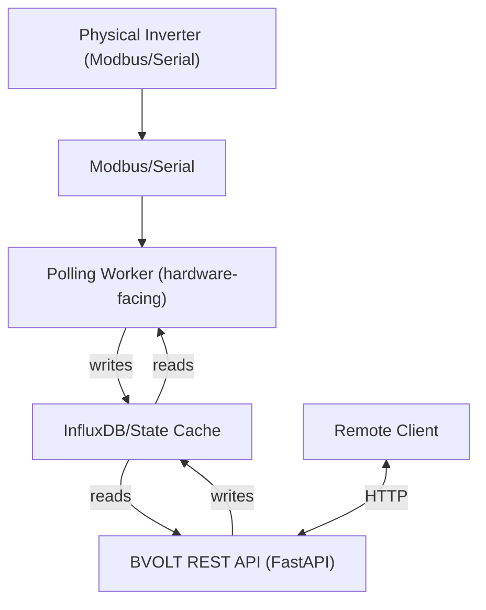

# bvolt
A modular plug-and-play Microgrid Digital Twin environment for simulation, modeling and control of renewable energy resources.

## System Architecture

The BVOLT platform is organized around a strict separation between
hardware access, state persistence, and remote API exposure.

